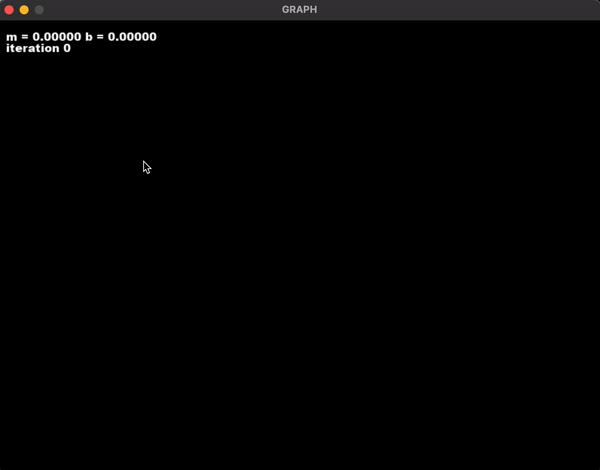

# Interactive Linear Regression Graph

An interactive linear regression graph using gradient descent or least squares



## Installation

Use the package manager [pip](https://pip.pypa.io/en/stable/) to install the requirements.

```bash
pip install -r requirements.txt
```

## Usage

```bash
python3 graph_linear.py [-h] [-g | -l]

optional arguments:
  -h, --help          show this help message and exit
  -g, --gradient      use gradient descent
  -l, --leastsquares  use least squares
```
